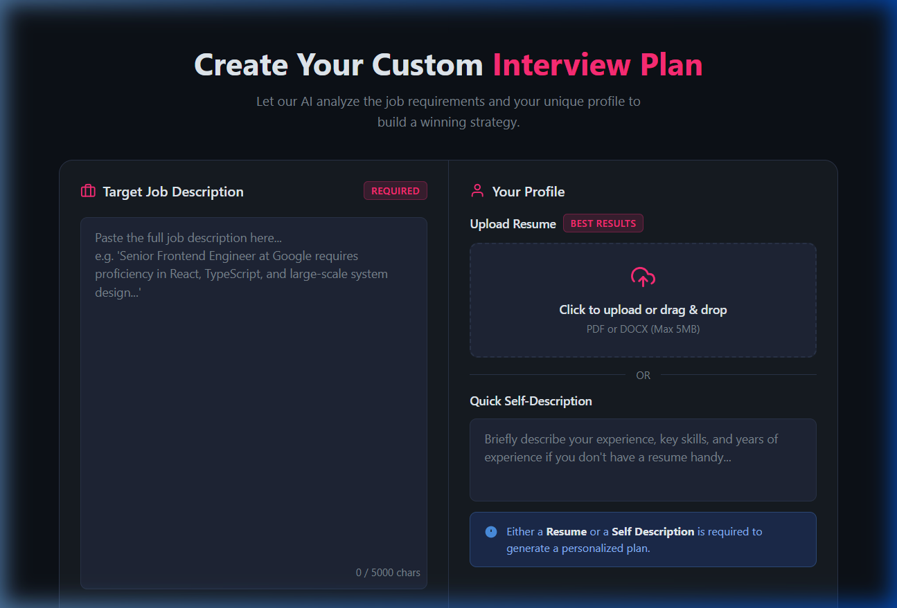
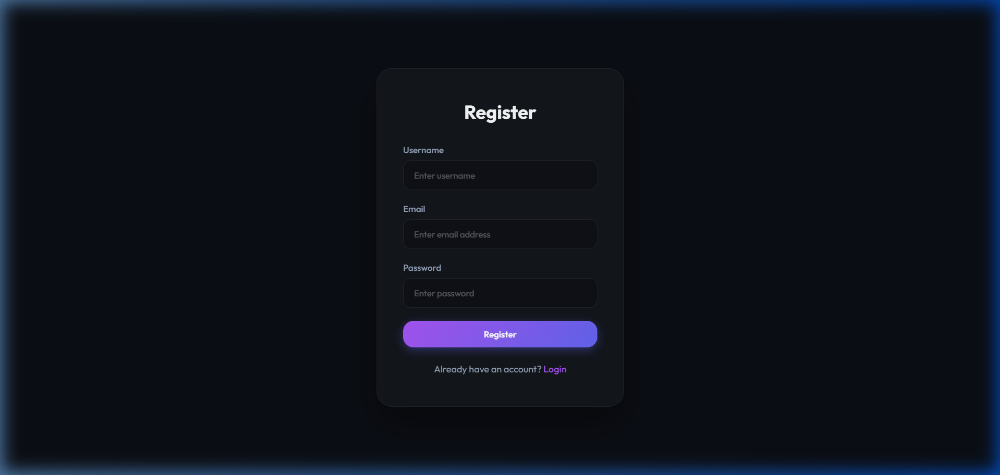
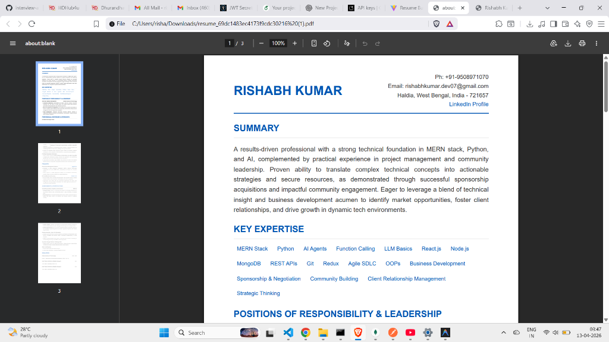
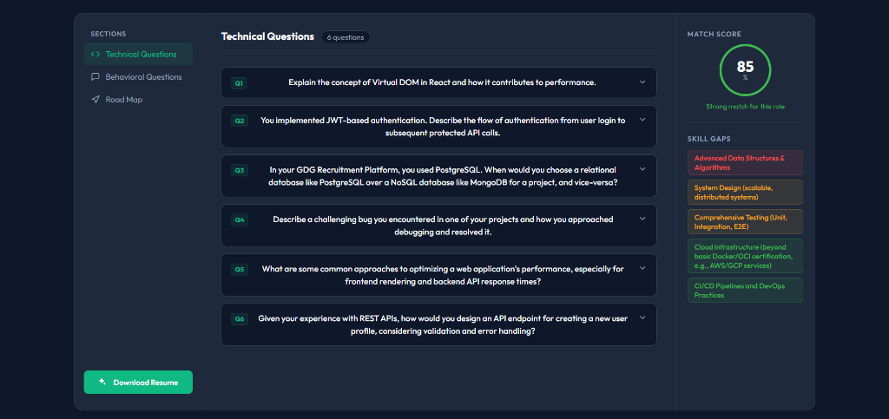
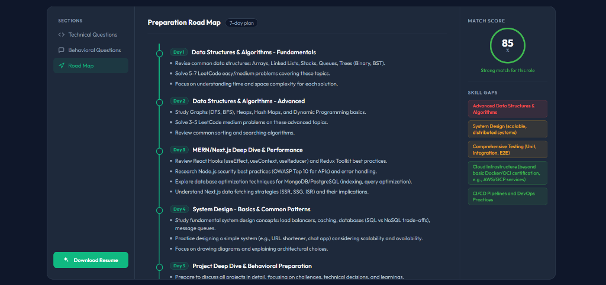

# Resume-Builder.AI 🚀

An advanced, AI-powered Full-Stack Resume Builder designed to dynamically craft perfectly tailored resumes based on Job Descriptions. This application utilizes modern Slate & Emerald minimalistic aesthetics, ensuring a professional, ATS-friendly output every single time.

## 🌟 Key Features

- **AI-Powered Generation**: Instantly maps your underlying self-description and skills to specific job requirements using Google Gemini 2.5 Flash.
- **ATS-Optimized Resumes**: Generates mathematically structured, perfectly aligned PDF resumes that reliably pass Applicant Tracking Systems (ATS).
- **Slate & Emerald UI**: A completely overhauled, distraction-free modern UI minimizing visual fatigue with crisp `#0f172a` backgrounds and `#10b981` primary accents.
- **Dynamic Secure Auth**: Robust encrypted authentication via HTTP-only cookies featuring seamless Vite proxy bridging.
- **Fast PDF Compilation**: Downloads print-ready PDFs flawlessly bypassing massive system architecture requirements.

## 🛠️ Technology Stack

### Frontend
- **React.js (Vite)**
- **CSS3 / SCSS** (Custom modern flat variable styling)
- **Axios** (Configured without baseURLs linking natively through a dev proxy)

### Backend
- **Node.js & Express**
- **MongoDB (Mongoose)** for scalable dataset storage
- **Google GenAI API** for logic interpolation
- **Puppeteer** for HTML-to-PDF compilation rendering
- **JWT** (JSON Web Tokens via Cookies)

## 📄 Core Application Capabilities

### 1. Dynamic PDF Resume Generation
Say goodbye to poorly formatted exports. Resume-Builder.ai flawlessly compiles an ATS-friendly, visually striking PDF containing your summarized metrics and optimized bullet points directly from your job description.
*(Showcasing zero-gap formatting and elegant typography)*

### 2. Tailored Interview Q&A Generation
Don't guess what the recruiter will ask. The AI cross-references your current resume with your target job description to generate high-probability **Technical** and **Behavioral** questions, complete with the intention behind each question and how to answer it perfectly.

### 3. Day-Wise Preparation Roadmaps
No more unstructured studying. The platform analyzes your exact skill gaps and formulates a rigid, easy-to-follow, day-by-step preparation plan telling you exactly what topics to focus on before your interview date.

## 🚀 Future Roadmap
- Direct Overleaf / LaTeX code snippet export options
- Custom styling templates (Double column, Classic, Creative)
- Multi-user collaboration capabilities

---
*Created by [Rishabh Kumar]*
